# 180版BMCU组装教程

::: info 提示
该内容来自群友`@白小淘`
:::

#### 除3D打印文件外的其他物料准备:

180版本基于130版本修改而来, PCB完全一致, 关于PCB的信息, 请参照130教程完成. 

物料清单变化也比较小, 所以在此只有相对于130的变化说明, 完整清单可以查看130教程.

物料清单的变化如下:

1. 由原版130电机修改为180电机, 建议购买轴长在10mm-12mm的180电机, 大多数额定电压12V-24V的180电机应该都可以工作, 用量为4个, 推荐的型号有两款:
   1. PWN17VEE12JA1 https://item.taobao.com/item.htm?_u=qu6u6p3c2bf&id=650572440927&spm=a1z09.2.0.0.7c412e8dH0f2vw 整理时的售价为1.8元.
   2. FK-180SH-12280 (已大幅涨价)
2. 修改了缓冲器弹簧, 规格为0.5 x 6 x 15mm, 用量为4个, 购买链接: https://detail.tmall.com/item.htm?_u=qu6u6p36069&id=649882524891&spm=a1z09.2.0.0.4d042e8dhdKyYV&skuId=4728198936063
3. 增加了离合弹簧, 规格为0.4 x 3 x 5mm, 用量为4个, 购买链接: https://detail.tmall.com/item.htm?_u=qu6u6p36069&id=649882524891&skuId=4686949972659&spm=a1z09.2.0.0.4d042e8dhdKyYV
4. 180组装教程中有使用到M2x5沉头自攻螺丝, 数量16个, 如果没有购买, 可以使用130教程中的M2x8替换.

#### 外壳3D打印文件:

外壳进行了完整的修改, 需要全部打印.

第一版仅适用于全金属外壳的180电机, 如果购买了上面链接推荐的PWN17VEE12JA1电机, 需要打印第二版文件.

如果没有特殊要求或不知道两个版本的区别, 请打印第二个版本.

第一版: https://makerworld.com/zh/models/1132822#profileId-1133350

第一版里有两个打印配置, 第一个配置是一套完整的组件模型, 需要打印4套, 第二个配置仅包含"离合器零件B-4mm厚242A", 适用于4mm的242A齿轮, 242A齿轮购买链接中的参数显示该齿轮厚度为4mm, 但实际收到的厚度为3.2mm. 如果真的有4mm的242A齿轮, 需要用第二个配置中的离合器零件B

第二版: https://makerworld.com/zh/models/1152568#profileId-1156984

第二版修改了外观, 以及切掉了阻挡塑料后盖180电机的一些特征, 可以兼容全金属与塑料后盖的180电机, 打印配置包含一套完整的组件以及一个安装辅助件.

除组件外, 如果是第一次组装BMCU, 还需要底座和支架, 请使用群文件"BMCU整合打包-V1.1"里的底座和支架文件.

#### 组件组装:

两个版本的缓冲器长度不同, 第二版电机安装位比第一版大, 其他一致, 教程使用了第二版.

1. 拿出底盖, 并在LED孔中穿上透明耗材, 之后将耗材两端切至与底盖表面平齐:

2. 拿出耗材流道盖, 并使用M2 x 8平头自攻螺丝锁到底盖上:

   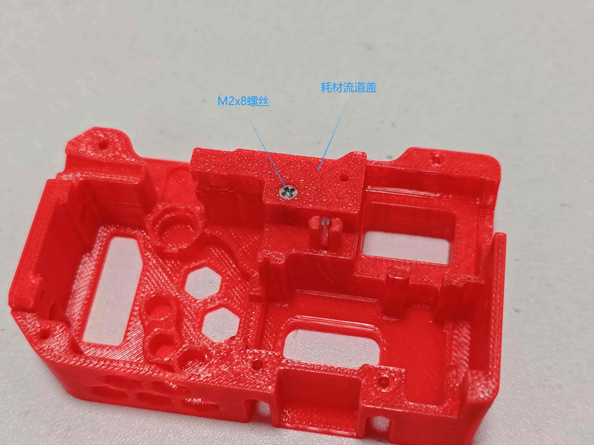

3. 将M6气动连接器拧到缓冲器上, 第一版与第二版的缓冲器长度不同, 但没有其他区别.

   

4. 拿出一个0.5x6x15mm规格的弹簧, 放到缓冲器上, 然后再放上一个62B轴套, 捏住之后安装到底盖上:

   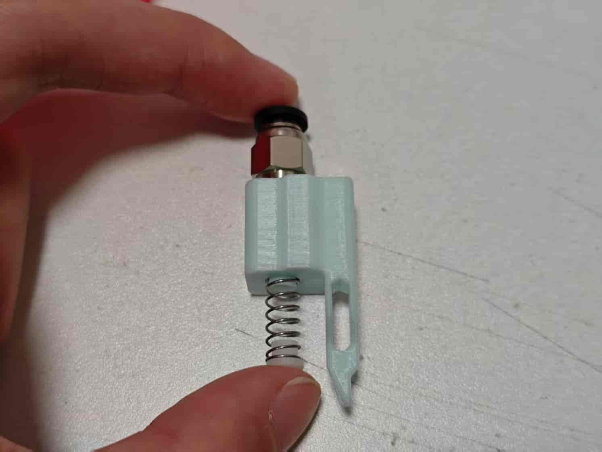

   

5. 拿一个628蜗杆, 放在辅助安装件上, 之后用电机轴对准蜗杆孔, 按到底.

   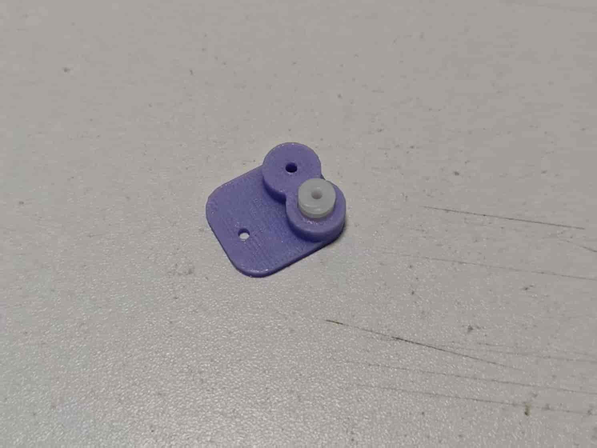

   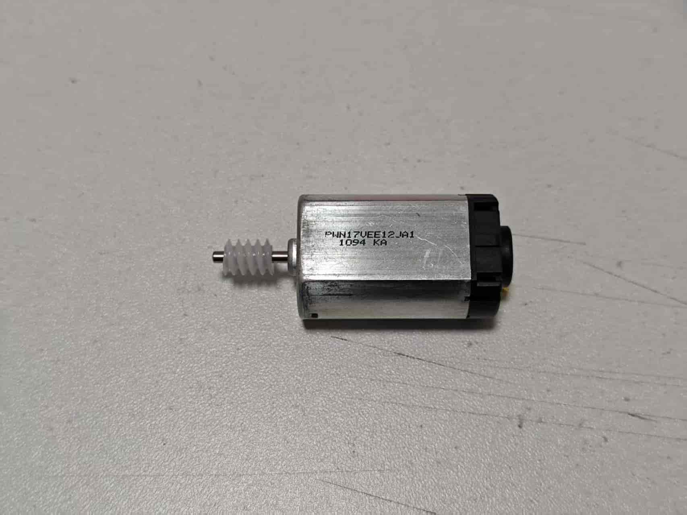

6. 给电机焊接连接线, 线长建议50mm左右. 请注意连接线的方向!

   

7. 焊接完成后, 将整个电机部分安装到底盖上:

   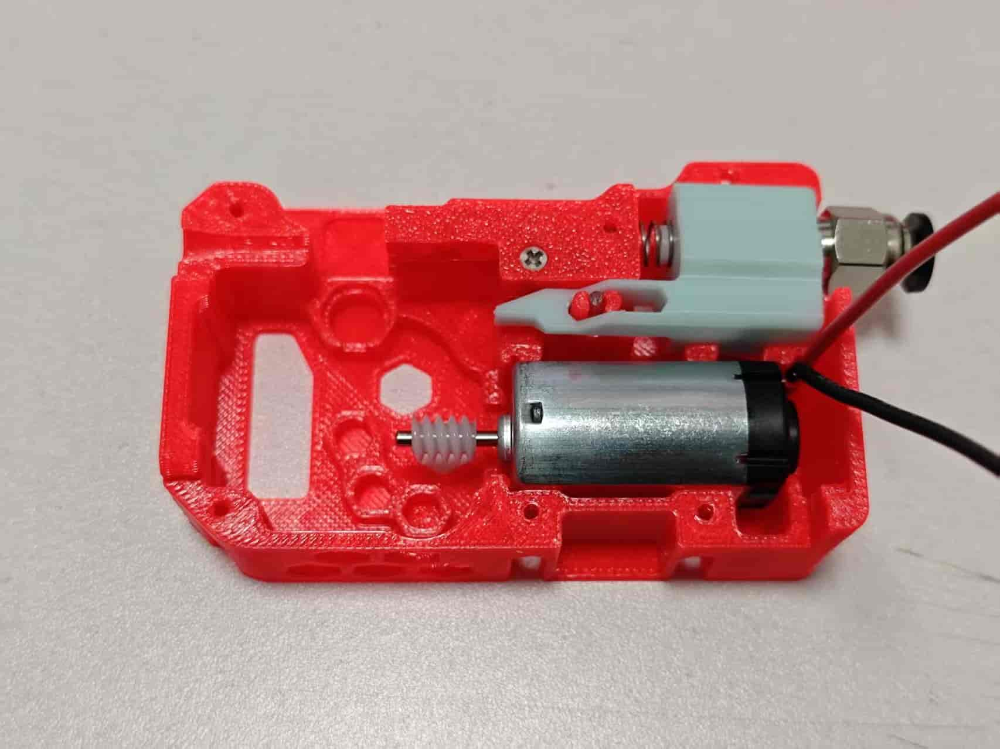

8. 取4个62B轴套, 安装在底盖上:

   

9. 取两个182A齿轮, 与两根2x6mm轴, 安装到一起, 齿轮应该位于轴的中间, 可以使用安装辅助件帮助安装.

   

10. 取一个242A齿轮和一根2x20mm轴, 安装到一起, 可以按图1方向使用辅助安装件按到底确定长度, 齿轮具有较薄台阶的一面离轴端面距离应该是6.1mm左右.

    

    现在是已经安装好的3个齿轮:

    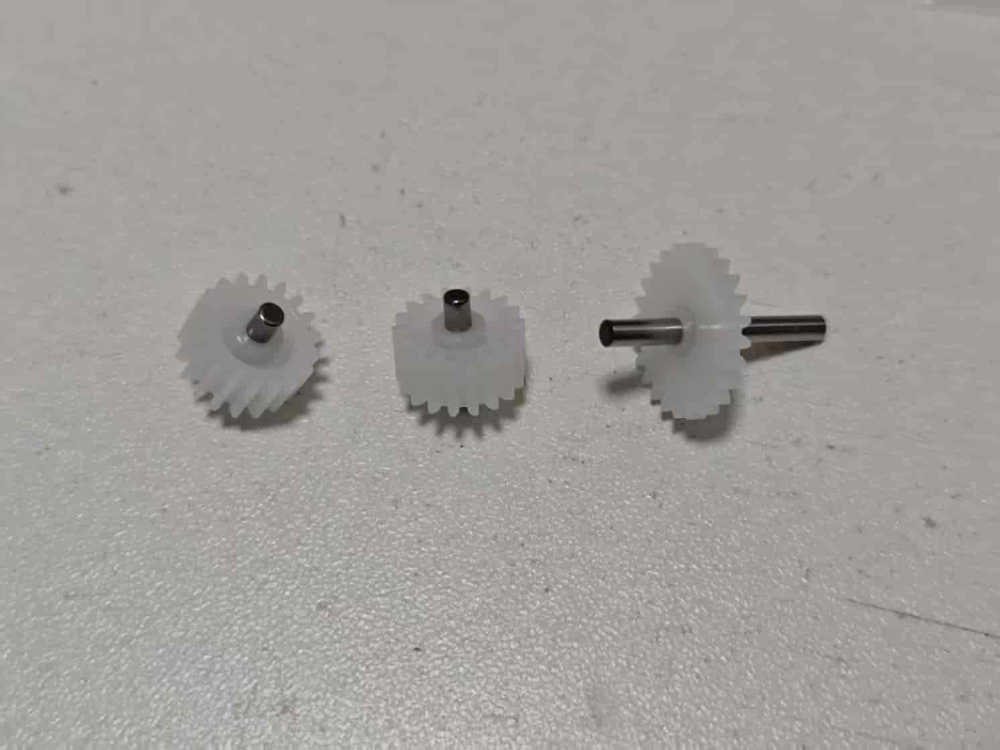

11. 拿出离合器零件B, 在侧面的孔中放入一个0.4x3x5mm的弹簧:

    

12. 使用一个3mm粗的工具压住弹簧(图中使用了3mmSL螺丝刀), 然后将242A齿轮按下图方向插入离合器零件B(齿轮有台阶较大的一面朝下, 台阶较小的一面朝上):

    

13. 之后在另外两个孔中放上182A齿轮, 如果182A齿轮不完全在轴的正中间, 请把轴较短的一端放入离合器零件B:

    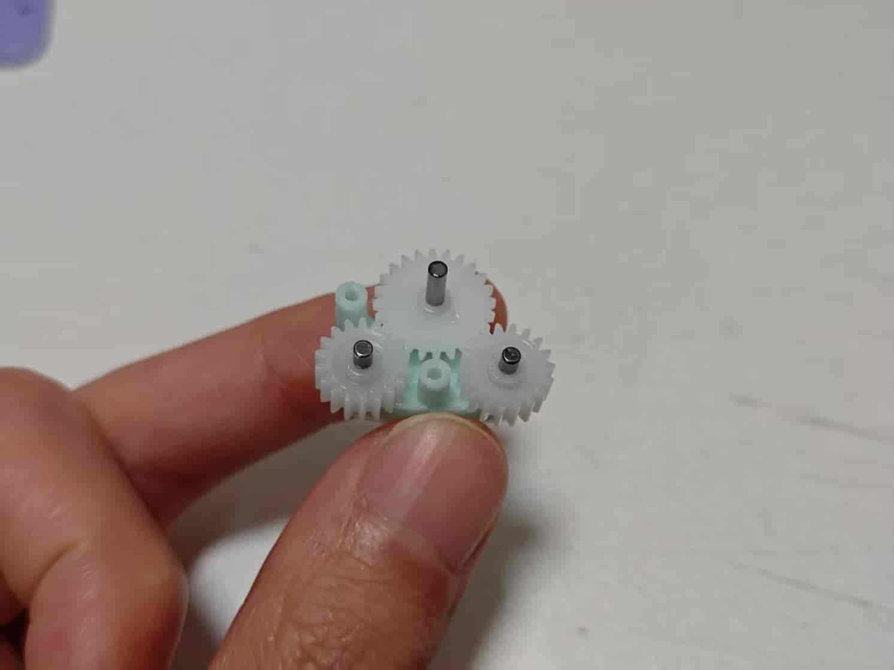

14. 放上离合器零件A, 并锁上两颗M2x8螺丝, 完成这些后, 离合器齿轮应该可以转动, 但能明显感觉到弹簧带来的阻力:

15. 将离合器按下图方向放入底盖:

    

16. 按下图顺序放入两个20082B齿轮, 并放入2x20mm轴:

    

17. 取出BMG零件包里带有螺丝孔的挤出轮, 两个MR85轴承, 以及一根5x22mm轴, 按以下顺序组装: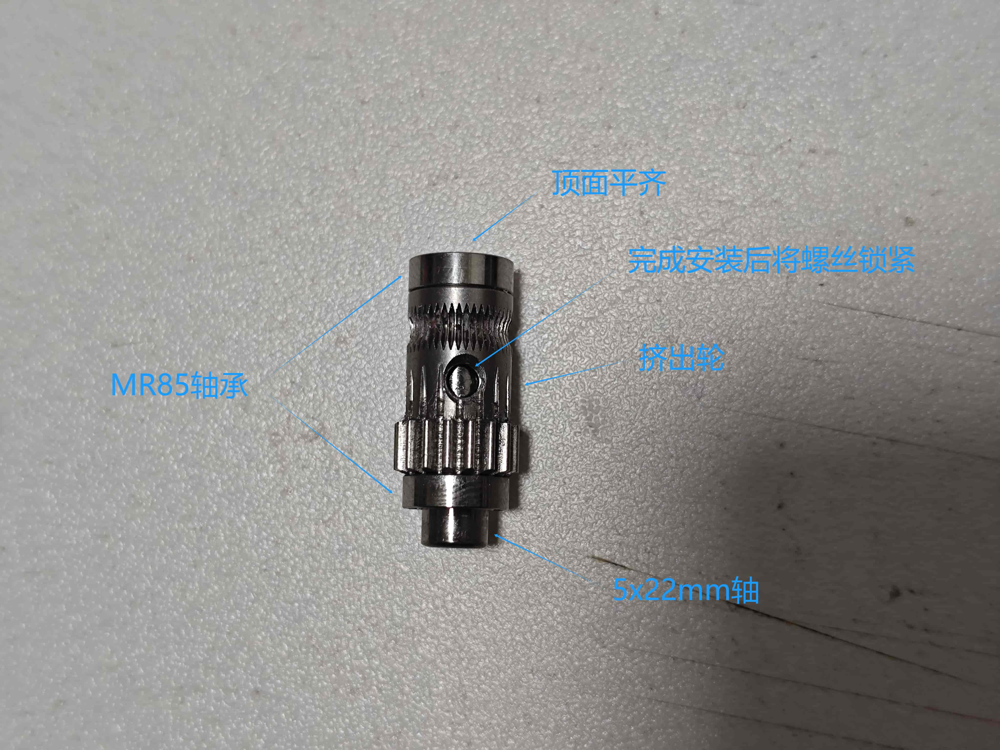

18. 组装完成后将挤出轮放到底座上, 如果没有其他事项, 现在就可以给所有POM齿轮上润滑脂:

     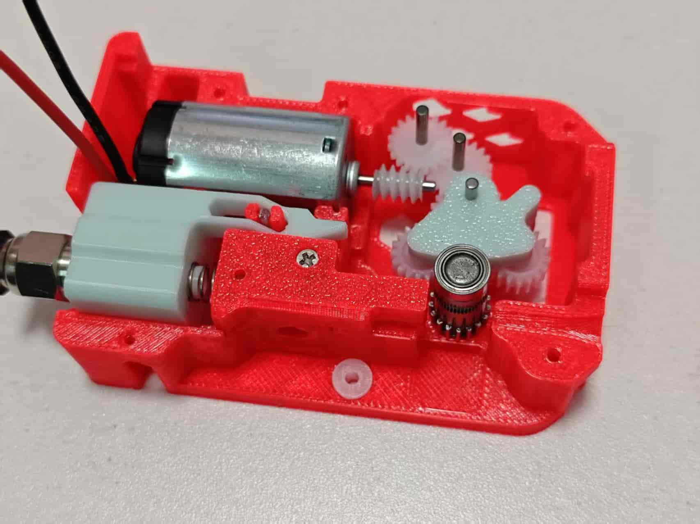

19. 拿出中框和4个62B轴套, 将轴套安装在中框上:

    

20. 将安装好轴套的中框放在底盖上, 将所有轴对准轴套, 装平:

    

21. 现在握住整个组件, 翻到反面, 将所有5个孔都锁螺丝, 螺丝的规格为M2x8:

    

22. 再将组件翻过来, 安装磁铁, 磁铁应该能随着挤出轮转动:

    

23. 将组件PCB放到组件中框上, 然后锁上M2x8螺丝:

    

24. 将电机线修剪到合适长度, 然后焊接到组件板上:

    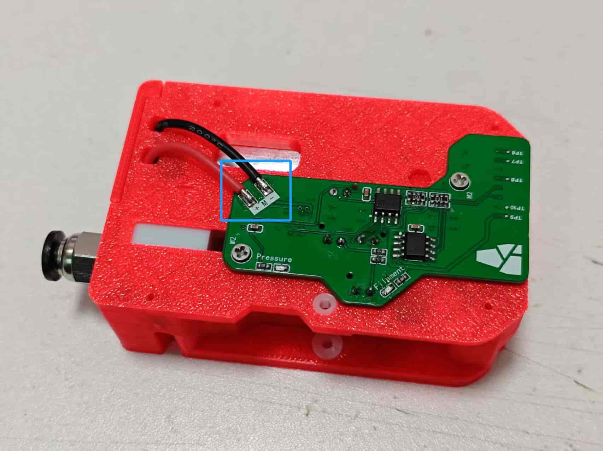

25. 拿出手柄, 将BMG零件包里的2个滚针轴承放到没有螺丝孔的挤出轮中, 并将挤出轮放到手柄中间, 注意安装方向:

    

26. 将BMG零件包里的轴取出, 安装到手柄上, 安装完成后, 挤出轮应该可以在手柄上顺滑转动:

    

27. 将手柄放到组件上, 在中间弹簧孔上放置好0.5x6x10弹簧:

    

28. 压紧手柄, 然后从右侧穿入2x6轴:

    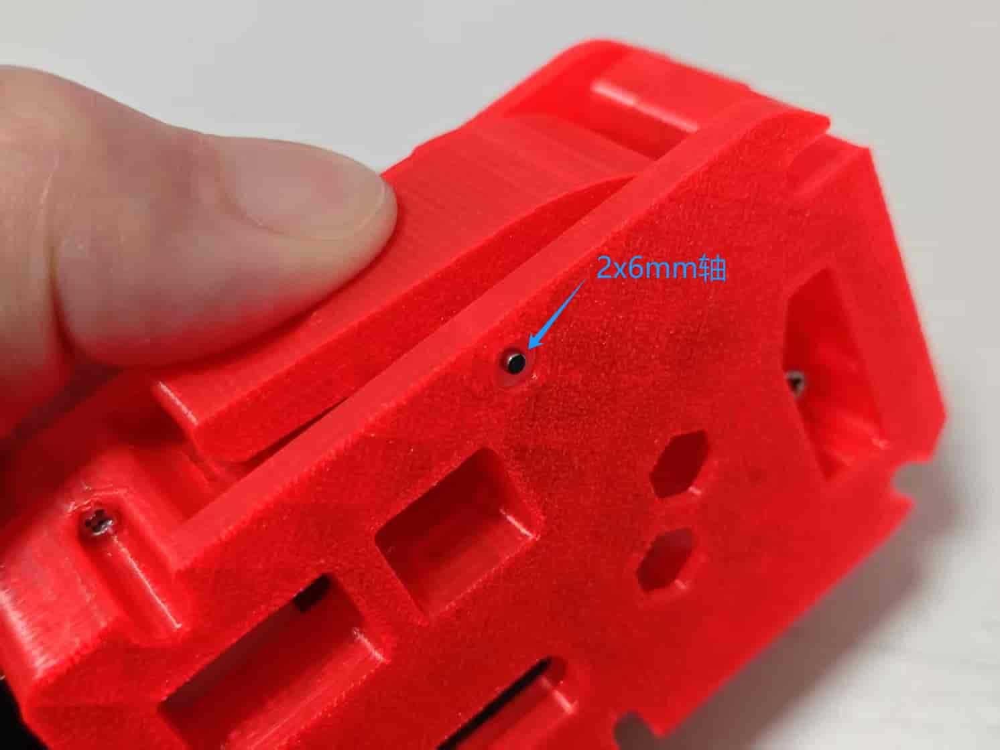

29. 压住手柄并转到另一边, 放入2x20mm轴, 并压到底, 压到底后, 轴应该会突出一些(像图中一样):

    

30. 现在可以装上后盖, 锁上全部4颗螺丝(M2x8), 一个组件就已经安装完成了.

    

31. 另外3个也是同样的安装方法, 安装完成后, 请查看130教程测试组件是否正常.