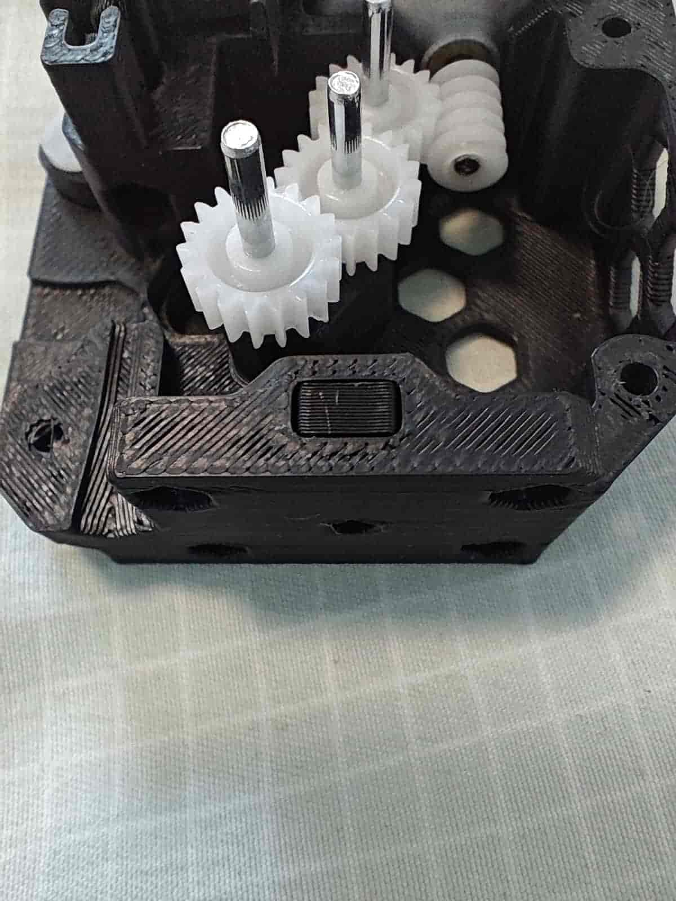

# 370钢珠版制作教程

## 目前是初版教程 我刚打完还没审稿

## 前言

这是适用于3-14版本的370钢珠版制作教程，对于其他钢珠版也一定程度的适用。

若还没有零件，请前往[材料清单](/doc/prepare/list)购买。

这篇教程是我发烧的时候做的，如果对您有所帮助，欢迎前往[支持wiki运行](../other/donate.md)赞赏我~

## 组装前需提前准备

您需要一套焊接完毕的BMCU电路板，确保没有任何焊接缺陷（如虚焊、漏焊、连锡、焊错等），然后对其进行固件刷写，固件烧录教程暂时请前往群文件查找。

您需要刷入3-14版本的固件，该版本同时适用于A系列和P系列

适用于本教程的整合包：[到这里下载3-14整合包](https://www.123912.com/s/qX7iVv-ZVxbv)，提取码：wanz

## 送料组件组装

### 组件名称介绍

- ①后盖
- ②中框
- ③前盖
- ④扳手
- ⑤滑块柱（缓冲器）
- ⑥钢珠滑块/断料滑块
- ⑦螺母塞
- ⑧滑块（缓冲器）

### 安装轴套

按照下图将62B轴套塞入后盖以及中框中

### 组装182A齿轮和2\*20轴

把轴按照下图压入齿轮中，使两端露出的长度相近即可

### 给370电机安装蜗杆

对于`佳立电机`购买的电机，把蜗杆压倒底，长度正好

### 组装缓冲器

把`滑块柱`与`滑块`组装到一起

在组装好的缓冲器上套上`0.6*12x30mm弹簧`，并放入`后盖`中

让弹簧卡在后盖边缘

### 安装电机和齿轮

把前面做好的齿轮和电机放入后盖

螺丝刀穿过底部的孔，使用`m3*5`平头螺丝固定370电机

### 安装断料检测部分

按照下图把`钢珠`放入`后盖`

然后再把`钢珠滑块`放入`后盖`

### 安装六角螺母

3-14版把此处的自攻螺丝孔改为了机牙螺丝适用的螺母，以避免频繁拆装`送料组件`与`底座`导致的孔位滑丝

把`六角螺母`放入`后盖`

塞入`螺母塞`，以固定`六角螺母`

### 安装bmg主动轮

下图是BMG齿轮组套装的所有零部件

取一个`D5x22mm轴`和两个`MR85ZZ轴承`，将轴压入其中一个轴承中，使底面齐平

::: danger 注意
安装时请均匀施力，水平竖直的安装，以免轴承卡住无法正常安装和调整，同时据说这个轴的精度不佳，请取用前自行评估
:::

按照图示方向放入带有顶丝孔的`bmg挤出轮`

用`内六角扳手`把`顶丝`安装到`bmg`的顶丝孔中

安装顶部的轴承，使其和bmg挤出轮贴合

将刚组装好的这个`bmg主动轮`按照图示方向，齿轮朝上放入`后盖`中

### 组装bmg从动轮

把两个`滚针轴承`放入剩下的不带顶丝孔的`bmg挤出轮`中

把它放到扳手里，**注意安装方向**，并插入`bmg齿轮包`中附带的轴

### 给齿轮上润滑

我使用的是虎头的“车门铰链与滑道润滑脂”，您可以选择其他`润滑脂`，但请注意**不要使用润滑油**

### 放入钢珠弹簧

### 合上中框

用`m2*8`螺丝固定中框

### 安装扳手

把`扳手`放入刚才那一坨东西中，放入`0.6*4x10mm弹簧`

用手压住扳手，并插入一根`2*20轴`以固定扳手

### 安装缓冲器气动接头

把气动接头拧入缓冲器

### 放入径向磁铁

把径向磁铁放到中框的磁铁洞中，使磁铁略低于中框

这个图是偷的370x的，都一样

#### 如何区分轴向磁铁和径向磁铁

径向磁铁更容易横着吸，而且横着吸的磁力更大，横着吸的时候可以随意旋转。

::: info 建议
在此时插入耗材，使用12v~24v电源接通电机以`测试是否可以拉动耗材`、`磁铁是否跟着转`以及`将润滑脂抹匀`
:::

::: tip
可以塞入光纤到缓冲器旁边的小孔，塞到底剪断，用于导光
:::

## 安装电路板并测试

### 安装

把副板以光电朝下的方向放到中框上，**用两颗`m2*8`螺丝固定住**

把前盖通过四颗`m2*8`螺丝固定到中框上

把副板用排线接到主板

主板通过USB转TTL模块连接电脑，只需要接入正负极即可，或者完全按照烧录固件时候的接线亦可

### 测试

> 我的图是全套装好的成品拍的，效果一样，建议做好一个通道就测试，以避免不必要的麻烦

上电什么都不做是这样的（主板没拍到，是红灯）

> 副板ws2812红色，缓冲灯亮起，耗材在线灯不亮 

按下扳手，插入耗材丝，松开扳手，是这样的

> 副板ws2812红色，缓冲灯亮起，耗材在线灯亮起

在上一步的基础上拉开缓冲器，是这样的

> 副板ws2812红色，缓冲灯不亮，耗材在线灯亮起

## 安装送料组件和电路板到底座

很简单，按照下图看吧

使用三个`m2*8`自攻螺丝固定主板，使用四个同款螺丝固定主板盖

使用`m3*14`平头螺丝固定送料组件和底座
