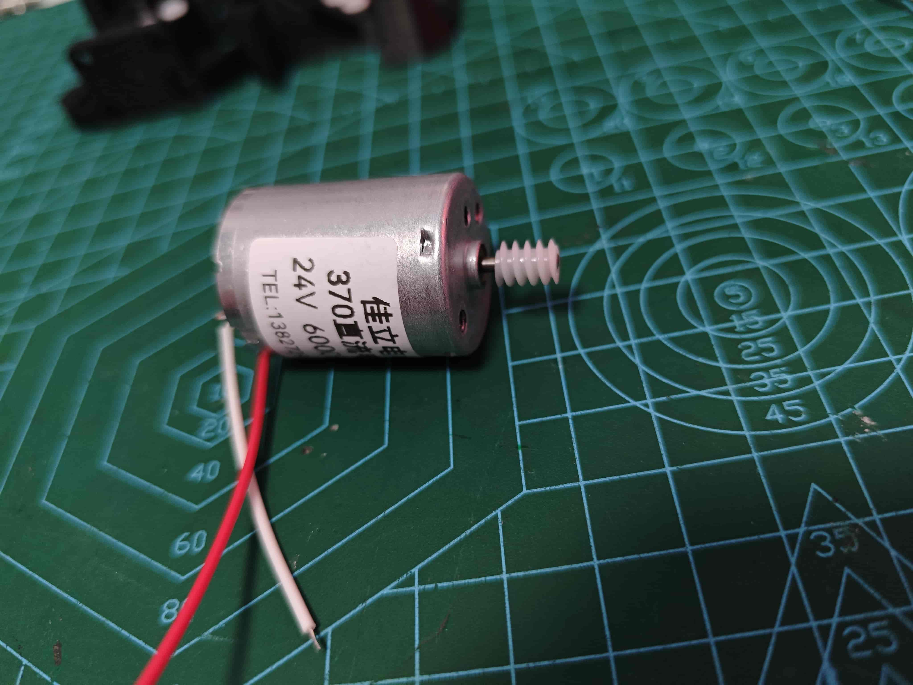

# BMCU-C（370霍尔版）制作教程

## 文章初次编辑 暂未审稿 请自行鉴别准确性

## 前言

本文全文由丸子编写

这是适用于BMCU-C v0.2版本通道组件的制作教程

若还没有零件，请前往[材料清单](/doc/prepare/list)购买。

该文章的撰写日期（25.4.16）是我的生日哦

如果该文章对您有所帮助，欢迎前往[支持wiki运行](../other/donate.md)赞赏我~

## 组装前需提前准备

适用于本教程的整合包：敬请期待，先去群文件找

- 一套焊接完毕的BMCU`霍尔版`电路板，确保没有任何焊接缺陷（如虚焊、漏焊、连锡、焊错等），然后对其进行固件刷写，固件烧录教程暂时请前往群文件查找。
- 对主板刷入适用于霍尔版的固件，截至25.4.16日，最新可用的固件为`BMCU-C-4-13测试`
- 打印件外壳
- 打印件[磁铁极性确定装置](https://makerworld.com.cn/zh/models/1141340)

## 正文

### 组件名称介绍

### 安装轴套

按照下图将62B轴套塞入后盖以及中框中

### 将D2*20轴与182A齿轮组装

使两端露出部分长度近似

### 给370电机安装蜗杆并焊接电机线

令电机轴与蜗杆齐平，若不放心可在此处点502胶水。

电机有红点的引脚为正极

### 确定滑块磁铁的极性

::: tip
尽管仍有很多确定磁极的方式，在此恳求您打印我设计的[磁铁极性确定装置](https://makerworld.com.cn/zh/models/1141340)，您的打印可以使我获得拓竹积分，作为我维护wiki的动力，万分感谢您的支持
:::

找来一个容器（碗、盘子、水瓢、脸盆等均可），加入适量水

将两个D3*10磁铁吸在一起，放入[磁铁极性确定装置](https://makerworld.com.cn/zh/models/1141340)，并将装置浮在水面

待稳定后，磁铁朝向南方的一端为南极，另一端为北极

### 将磁铁装入滑块

按照下图方向摆放滑块，则磁铁南极朝下插入滑块此处（南极靠近气动接头安装位置）

重要：**令磁铁处于滑块磁铁安装位的正中间**

### 固定滑块磁铁

使用M2*8自攻螺丝拧入滑块

### 安装电机

将电机放入此位置，并使用一颗M3*5机牙螺丝拧紧固定

### 安装螺母与螺母塞

将一个M3六角螺母放入此处凹槽，并塞进螺母塞以固定（忘了拍图，挺好理解的，意会一下）

### 放入齿轮

### 组装BMG主动轮

参考370钢珠版教程的[相关部分](./370#安装bmg主动轮)

### 组装BMG从动轮

参考370钢珠版教程的[相关部分](./370#组装bmg从动轮)

### 放入BMG主动轮

### 放入钢珠

### 放入断料滑块

注意滑块方向

### 上润滑

给齿轮进行润滑（可以拿下来润一圈放回去，BMG就不用润滑了）

给滑块进行润滑（可选）

### 安装滑块与滑块弹簧

将两个`0.8*12*25弹簧`放入滑块两端，卡在滑块安装位内（图中我为了演示临时使用了370钢珠版用的0.7*12*30弹簧，必须扶着才不会飞出来，您安装时不会这样困难）

### 安装断料滑块弹簧

将一个`0.3*4*5弹簧`放入断料滑块上方

### 安装中框

将中框扣在后盖上，滑块有磁铁的那部分是要穿过中框的

拧上五个M2*8自攻螺丝固定

### 安装扳手

将一个`0.6*4*10弹簧`放入如下位置，放入准备好的扳手

::: tip
若您的管线及料架阻力较大，或者您使用p1打印机，请使用[此模型](https://makerworld.com.cn/zh/models/1167775)垫在扳手弹簧槽内，以增大咬合力
:::

用手按住扳手，穿入一根D2*20的轴

用东西垫着用力压入到底，在用螺丝刀深入压入凹坑底部

### 安装径向磁铁

在BMG主动轮上方吸附一个D6*2.5的径向磁铁，确保不会被任何东西压到，确保跟着bmg转动（重要）

::: info 建议
在此时插入耗材，使用12v~24v电源接通电机以`测试是否可以拉动耗材`、`磁铁是否跟着转`以及`将润滑脂抹匀`
:::

::: tip
可以塞入光纤到缓滑块旁边的小孔，塞到底剪断，用于导光
:::

### 安装副板

将副板放在此处

使用两个M2*8自攻螺丝固定，并焊接电机线

将长出来的线塞进此处

### 安装前盖

用四个M2*8自攻螺丝固定

### 安装气动接头

将气动接头拧在滑块上

### 完成

现在您可以接上主板进行基本的进退料测试了

若您发现无论如何4020规格的ws2812b灯珠都不会亮起，请检查您的焊接方向

#### 灯光状态

>下表中的`-`为不会影响此灯珠或此灯珠此时情况未知

| 情况                 | 侧灯 | 顶灯（光纤） | 故障处理                       |
| :------------------- | :--- | :----------- | :----------------------------- |
| 未安装径向磁铁       | -    | 红           | 检查径向磁铁安装和as5600焊接   |
| 正常情况             | -    | 蓝           | -                              |
| 通道被选中（使用中） | -    | 白           | -                              |
| 未插入耗材           | 黑   | -            | -                              |
| 耗材在线             | 白   | -            | -                              |
| 按下缓冲器（滑块）   | 蓝   | -            | 若侧灯为红色，反转滑块磁铁方向 |
| 拔出缓冲器（滑块）   | 红   | -            | 若侧灯为蓝色，反转滑块磁铁方向 |

主板：与打印机通讯正常为蓝色，不正常为红色，其他任何颜色为不正常
