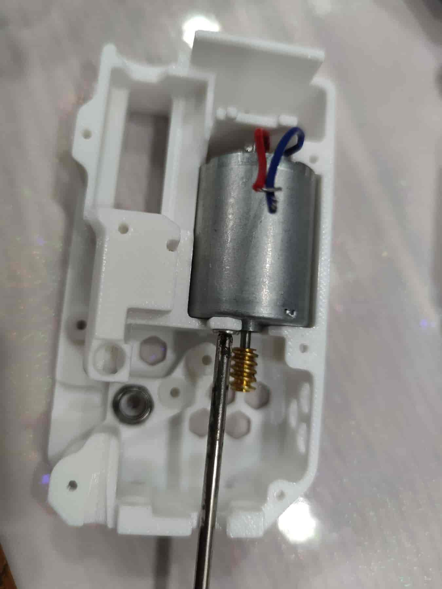
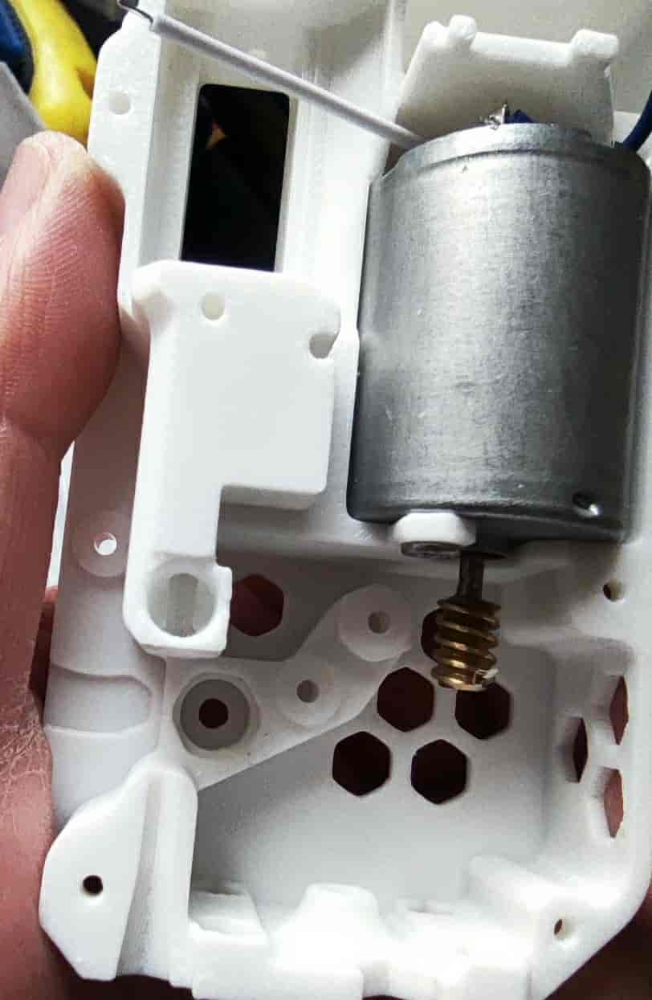
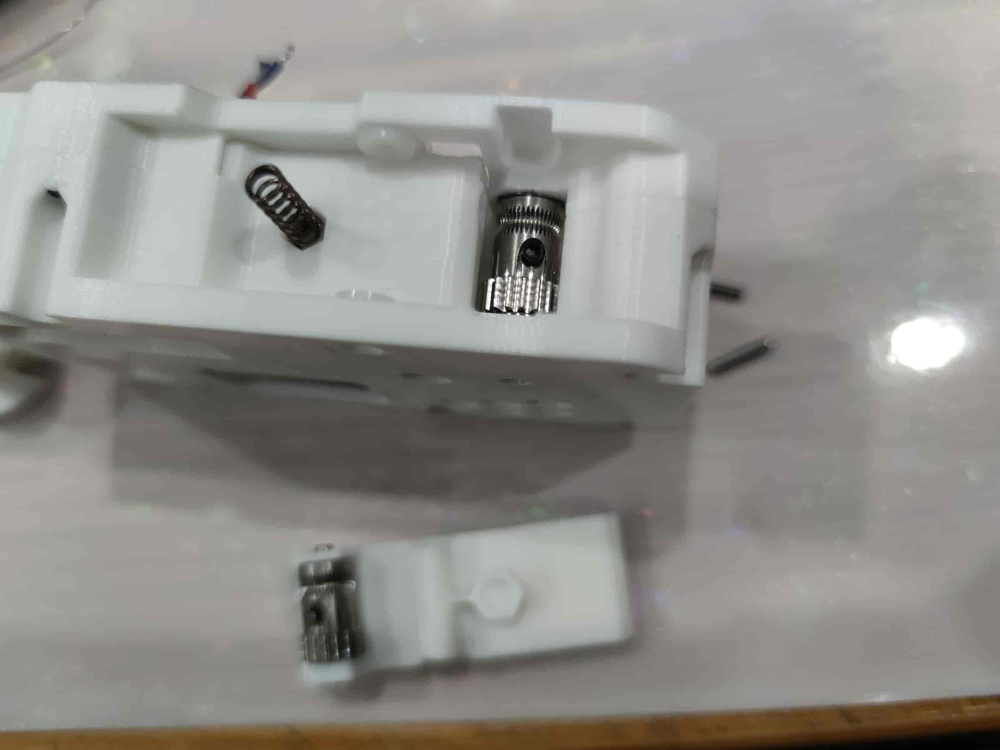

# 370电机版本 x BMCU-星尘微动修改版 组装教程

::: info 提示
该版本为群友 `@星尘` 的修改版，该内容也来自该群友
:::

## 简介

1. 本教程为 `370版本 X BMCU-微动修改版` 的组装教程，与原版兼容性很高，但并不是 BMCU370 原版。
2. 这意味着你可以拿来当做原版的 370 参考（非钢珠倒置版）。
3. 项目开源地址：[BMCUx - Oshwhub.com](https://oshwhub.com/xingcc1/bmcu-370x)
4. 项目模型地址：[Makerworld CN](https://makerworld.com.cn/zh/models/1000993-bmcu-370-tie-pian-wei-dong-bo-li-zhu-hong-fa-yuan#profileId-1026446) [Makerworld Global](https://makerworld.com/zh/models/1175070-bmcu-370-surface-mount-microswitch-glass-bead-trig#profileId-1184075)
5. 关于 P1 系列，你需要做一些改变比如内置五通，仍在完善中，完善后会更新。
6. 欢迎尝试测试固件（各种整理中），目前推荐 `BMCU测试固件2-6.bin`。
7. 你可以在这里定制固件，并进行测试：[bmcu370x github.com](https://github.com/Xing-C/BMCU370x)
8. 本项目模型改自版本号为 BMCU2.5 的外壳。

## PCB BOM

1. [【腾讯文档】BMCU370x - BOM清单](https://docs.qq.com/sheet/DTXJPYXVjVXpnY0F3?tab=000001)

## PCB 注意事项

遇到问题应当先查看左侧 - [[常见问题]](../prepare/prepare.md)。

### 主板焊接部分

1. 应当注意二极管方向。
   
2. 背面根据需求焊接。
   
3. 电机的电压选择与焊接
   
4. 从机部分切回双光电（130基础版）
   
5. 从机部分 - 功能
   

## 组件组装

1. 教程难免会有疏忽的地方，如有错误欢迎指正，可以与群友交流讨论。
2. 外壳基于第一版拍照，可能外貌略微不同。
3. 首先需要组装底壳部分。
   
4. 安装 3 个轴套与一个 MR85ZZ 轴承，你要保证轴套需工具按压的紧度才是最好状态。
   
5. 确保电机焊接好导线，如电机没有蜗杆，需使用塑料蜗杆插入并与电机轴平齐，然后放入到底壳，对准螺丝孔确保已经到位，使用 M3x5 平头螺丝进行锁紧。
   
6. 确保玻璃珠处足够圆润，如这里有小凸起，可用美工刀修一修。
   
7. 修好的样子，然后下一步。
   
8. 放入两根 m2x20 的轴销柱，对于金属齿轮，需使用 1.95/1.9 直径的，另外底壳/中框需要改动，因金属齿轮厚度不同，需注意, 不推荐金属齿轮。
   
9. 套上 182A 塑料齿轮并按压到低，注意角度和力度推荐先按压靠近电机的那个齿轮，对于金属齿轮直接放上去即可。
   
10. 拿出缓冲器圆柱打印件和滑块并扣装在一起，需要确定耗材丝能够几乎无阻力的情况下穿过圆柱体，否则需要调整孔洞补偿重新打印圆柱体。
    
11. 对于新的缓冲器圆柱体可能需要先放入弹簧（直径为 10 的弹簧）。
    
12. 拿出带孔的那个 BMG 挤出齿轮，找到黑色顶丝，一个 MR85ZZ 轴承，多个 M5x22 轴销柱，因公差关系需要先尝试用 M5x22 轴去插 MR85ZZ 轴承并寻找到合适的轴销柱，即能够较轻松放入的。
    
13. 先放置 MR85ZZ 轴承，使用挑选的 M5X22 轴销柱插入，然后把 BMG 齿轮没齿的那一面朝下套进去，如下图所示，确保都按压在最底下形成平面后，使用内六角扳手安装并拧紧顶丝，确保 BMG 能够通过轴销柱带动轴承能够一起转动。
    
14. 拿出并齿轮，对电机的蜗杆部分和 182A 齿轮进行润滑，然后放回去，但是别去润滑 BMG，以免润滑油/脂粘到耗材丝。
    
15. 确保放好了。
    
16. 然后放入 BMG 齿轮，确保上半部分不碰到润滑油脂，BMG 齿轮下半部分会被齿轮润滑一点，但不需要主动去润滑 BMG 齿轮。
    
17. 放入缓冲器以及弹簧，原版长度推荐为 35，加长版为 50 (mm)。
    
18. 把弹簧压进外壳，不要被弹出来。
    
19. 拿出中框打印件。
    
20. 安装三颗轴套到中框上，确保和底壳一样紧（通常中框轴套的安装会比底壳的要轻松一点）。
    
21. 准备安装中框，先把电机线穿出来相同长度不夹线，确保齿轮的轴对准中框的轴套孔，以及 BMG 齿轮那里的 MR85ZZ 轴承对准了槽位，并确保弹簧还在壳子里部分而不是卡着，中框安装好后可以试着扣一下弹簧。
    
22. 安装好的样子。
    
23. 小心翼翼的翻转到背面，然后用力按压减少缝隙并拧紧 5 颗 m2x8 的自攻螺丝。
    
24. 准备安装扳手部分，0.6x4x15（推荐使用 0.4x4x15）弹簧，2 个 M2x10 的轴销柱，以及 BMG 包里的 2 个滚珠轴承、1 个轴销柱和 1 个 BMG 齿轮不带孔的（1688 购买可能都带孔）。
    
25. 塞入 2 个滚珠轴承到 BMG 齿轮里。
    
26. 然后拿出扳手打印件（如果不是站立打印的可能需要打磨），并把 BMG 齿轮放上去，注意方向，带齿的那一面朝向厚的那边。
    
27. 竖起来，然后按压安装套件里的轴销柱，确保两面都安装到位，轴销柱在中心。
    
28. 安装好后，试着转动 BMG 齿轮，应当旋转顺畅，否则需要打磨打印件。
    
29. 竖起送料组件，然后放入扳手弹簧 0.6x4x15（推荐使用 0.4x4x15）。
    
30. 然后安装扳手，确保弹簧对准孔位。
    
31. 然后用手捏住扳手和组件，放到平面横着，并能够看到轴套与扳手孔洞平齐，准备安装轴销柱。
    
32. 插上 M2x10 的轴销柱后用工具按压进去。
    
33. 确保安装到位，并且凸起不超过外壳。
    
34. 安装好后翻到另一面，同样捏住扳手齐平安装，M2x10 的轴销柱后用工具按压进去。
    
35. 确保安装到位，然后准备下一步。
    
36. 准备一颗 5mm 直径的玻璃珠（不推荐使用更重的比如钢珠）。
    
37. 放入孔位里，确保玻璃珠能够轻松放到底，最好是在朝下后能够掉出来。
    
38. 安装径向磁铁到 BMG 齿轮轴，径向磁铁尺寸为 6x2.5mm，径向磁铁安装后，高度应当与外壳有一定距离，如若转不动会出现问题，并且普通磁铁无法代替径向磁铁。
    
39. 然后放上组件 PCB。
    
40. 使用 2 颗 m2x8 的自攻螺丝固定，两颗螺丝都拧上去后再拧紧，可以避免 PCB 有点歪。
    
41. 使用烙铁焊接电机导线，对于旧版固件（如 130）需区分正负极不然会电机转反，对于新版固件（3-14 起）方向是由 BMCU 自动分辨的。
    
42. 放上组件上盖盖板，确保没有压到导线出现缝隙。
    
43. 拧上 4 颗 m2x8 的自攻螺丝，到此，你已经完成一个通道的组件组装，好棒耶。
    

::: info 提示
    送料组件决定了你的多色通道数量，为了让设备有意义，你需要安装2-4份的送料组件。
:::

## 总装

1. 待补充...