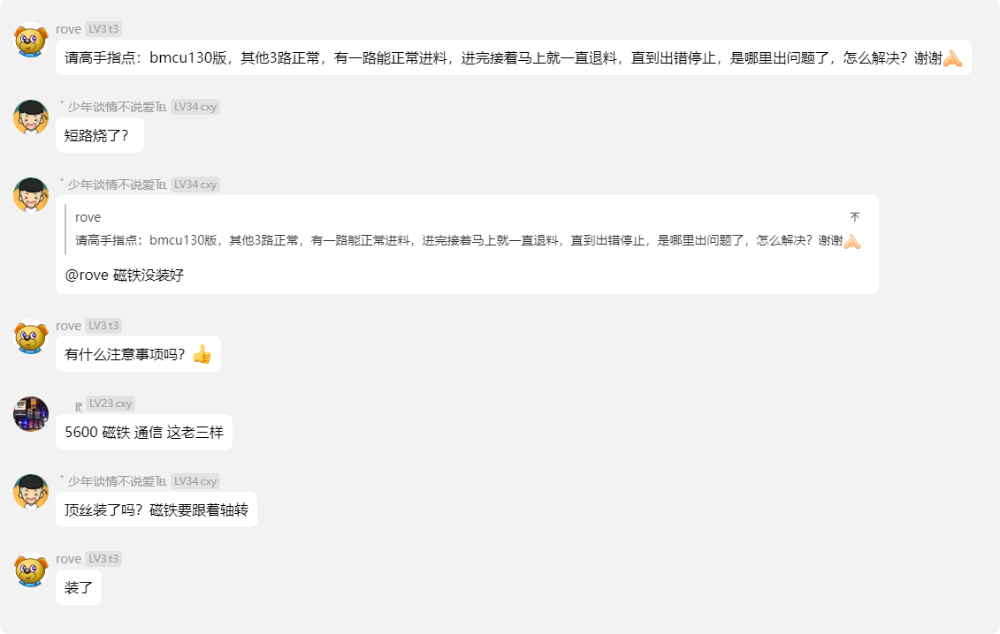
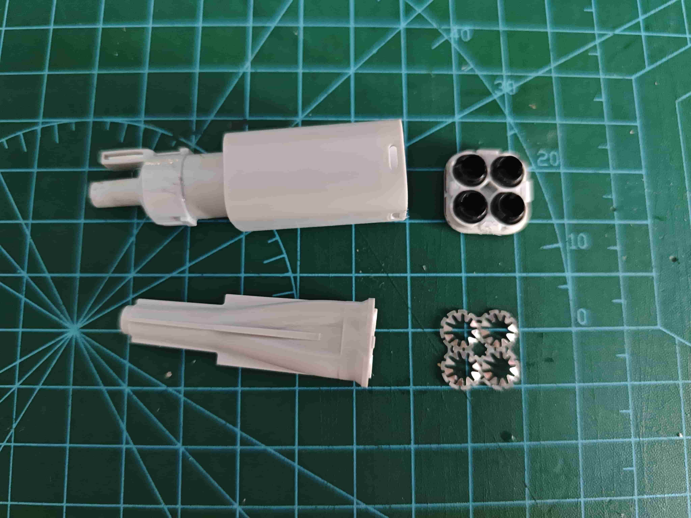

# 常见问题

::: warning 提示
本页内容仅为群聊内容或个人经验整理，未必准确
:::

## 固件相关

### 无法解除读写保护

检查以下项目：

- 是否已安装USB转TTL(串口)模块的驱动，通常是CH340通用串口驱动。
- 是否选择了正确的处理器型号'CH32V203'，以及下载方式为'串口'。
- 是否选择正确的端口号（前往设备管理器的`端口（COM和LPT）`中查看与购买模块所用芯片名称一致的项目的端口号，并在烧录软件中确认正确）
  > 如果设备管理器中有识别，但是烧录软件中没有对应的端口号，就点一下`搜索`按钮再展开列表选择
- 接线是否正确 正确的接线如下：

    | 主板 | 模块 |
    | :--- | :--- |
    | V+   | 3.3v |
    | GND  | GND  |
    | TX   | RX   |
    | RX   | TX   |

  > 市面上有极少数模块是tx接tx rx接rx的（例如esp01s的专用串口模块），这类模块请参考商品说明

- 是否正确按键，正确的操作为：
  
    1.接入杜邦线，并将串口模块接入计算机

    2.按住`B`键，短按`R`键

    3.在计算机上解除保护 并刷入固件
    > 文档中推荐全过程不松开B键

- 检查PCB焊接是否正常，是否有虚焊/漏焊/连锡

- 如果没有问题并且使用了ch340/cp2102的模块，可以尝试先点击下载-提示开启自动下载-确定-再次点击下载-提示读写保护已使能-这时即可进行接触保护，通常可能会在芯片已经下载过固件后遇到。

- 如果不是ch340/cp2102的模块，可以去买这两个芯片的模块，我用的是[这个](https://item.taobao.com/item.htm?abbucket=18&id=723291896174)
  

## 进退料相关

### 料丝行程异常

通常为磁铁或磁编码器（5600芯片）异常，请确认磁铁使用的是径向磁铁，带顶丝的挤出机齿轮不在扳手上，顶丝拧紧且电路板焊接无误

### 三角板跟着电机空转

该问题是由于三角板阻力过小导致，解决方法如下：

- 在三角板齿轮上添加较为粘稠的润滑脂以增加阻力
- 在三角板齿轮的轴处用502点一下，并将滴了502的一面朝下放置（防止流进齿轮），快干了的时候转一转齿轮，这样可以增加阻力又不会导致阻力不均
- 更换三角板的模型设计，重新打印制作，例如使用 `@晓心乐子人` [视频简介](https://www.bilibili.com/video/BV1PuPCehEP3)中的模型 或 MakerWorld中的[这个模型](https://makerworld.com.cn/zh/models/930560#profileId-938608)等
- 群友还有将BMCU侧置以避免重力影响的操作

### 电机转的时候齿轮咔咔响

蜗杆插入不够深，如果使用的是原版的`万宝至FF130-SH`，请直接把蜗杆插到与电机轴平齐，若是其他版本请自行摸索

>除此之外 请注意齿轮润滑，以免后续发生更多问题

### 退料把管子顶出来了

这是我遇到的问题，我的五通太松了，加上管子角度太大阻力大导致

方案：[将五通拆开](https://wiki.bambulab.com/zh/a1/maintenance/filament_hub_cleaning)，把铁片压平一些，并让特氟龙管靠近挤出机一侧垂直

[官方教程](https://wiki.bambulab.com/zh/a1/troubleshooting/ams-lite-filament-hub-cannot-hold-tube)

### 更多问题

请前往[安装教程的常见问题板块](/doc/build/130#常见问题及处理解析)查看
