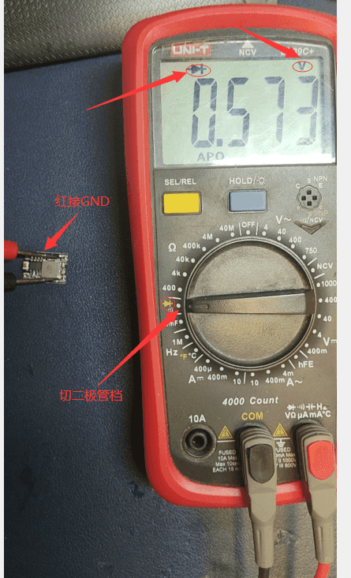

# 对地值参考

因测量点，表笔交错对阻值表现均不相同，二极体值更直观，此测量主要使用[二极体值](https://baike.baidu.com/item/%E5%AF%B9%E5%9C%B0%E6%89%93%E9%98%BB%E5%80%BC/5430067)
测法。操作方法如图。

该值体现的是芯片对地的数值。芯片集成度，温度，工艺，用料，万用表得不同，均会影响数值浮动，集成度较高得芯片通常会更低，如电脑CPU数值0.2v+，硅管0.6到0.7等，常见数值0.8以内，接近0可认为短路，OL视为开路，大于1V通常要交叉表笔测量对比数值以此判断芯片好坏，通常说此数值时不带单位如0.465V=465。

对于正向电压：红笔接地，黑接测点。

对于负向电压：黑笔接地，红接测点。（如电脑电源的-5V -12v）

如果被测点同时链接多个芯片，显示为最低数值的芯片

被测点到芯片之间串联电容无数值显示OL，线路开路显示OL，对GND0.000。

## 简单测量

焊接完成后

- 万用表调整到二极管档
- 红表笔接触到GND（IN -）
- 黑笔测量IN+(VIN24v)，输出+(3v3)
  
  如果显示0.000，则表示出现短路，参考值

  | IN+  | 3V3  |
  | :--- | :--- |
  | 560  | 430  |

  > 前文提过，因万用表与芯片工艺不同，该值会有所不同，可与电源模块或芯片未焊接前对比

上图中红色为3v3线路走向，绿色为24V线路走向。

测量TX RX对地是否一致，参考值730。

后续可以此法检查其他线路，附部分参考值

## 主板

以排线座从左往右依次，附个人实测四个通道数值

| 引脚序号 | 功能             | 通道1 | 通道2 | 通道3 | 通道4 |
| -------- | ---------------- | ----- | ----- | ----- | ----- |
| 1        | 缓冲触发         | 791   | 791   | 791   | 791   |
| 2        | 耗材反馈         | 535   | 545   | 545   | 547   |
| 3        | GND              | -     | -     | -     | -     |
| 4        | RGB OUT          | 810   | 790   | 555   | 555   |
| 5        | AS5600磁编码通讯 | 547   | 547   | 556   | 556   |
| 6        | AS5600磁编码通讯 | 557   | 547   | 556   | 547   |
| 7        | GND              | -     | -     | -     | -     |
| 8        | 3v3              | 430   | 同    | 同    | 同    |
| 9        | 10、电机         | 560   | 同    | 同    | 同    |

群友部分参考值：

| 引脚序号 | 功能             | 群友1 | 群友2 | 群友3 | 群友4 |
| -------- | ---------------- | ----- | ----- | ----- | ----- |
| 1        | 缓冲触发         | 730   | 712   | 702   | 645   |
| 2        | 耗材反馈         | 452   | 460   | 459   | 461   |
| 3        | GND              | 0     | 0     | 0     | 0     |
| 4        | RGB OUT          | 600   | 620   | 466   | 464   |
| 5        | AS5600磁编码通讯 | 461   | 461   | 465   | 466   |
| 6        | AS5600磁编码通讯 | 468   | 461   | 466   | 460   |
| 7        | GND              | 0     | 0     | 0     | 0     |
| 8        | 3v3              | 375   | 375   | 374   | 374   |
| 9        | 电机             | 499   | 497   | 474   | 501   |
| 10       | 电机             | 500   | 498   | 476   | 501   |

## 小板

小板部分从左往右依次线序同主板

我在表格中加入了参考值列，方便对比实际测量值：  

| 引脚序号 | 功能       | 参考值 | 小板1 | 小板2 | 小板3| 小板4 |
| -------- | ---------- | ------ | ----- | ----- | ----- | ----- |
| 1        | 缓冲触发   | 720    | 629   | 629   | 629   | 631   |
| 2        | 耗材反馈   | 720    | 630   | 630   | 630   | 631   |
| 3        | GND        | —      | 0     | 0     | 0     | 0     |
| 4        | RGB OUT    | 600    | 508   | 508   | 508   | 506   |
| 5        | AS5600通讯 | 560    | 483   | 483   | 483   | 481   |
| 6        | AS5600通讯 | 760    | 无    | 680   | 680   | 676   |
| 7        | GND        | —      | 0     | 0     | 0     | 0     |
| 8        | 3V3        | 440    | 388   | 388   | 388   | 388   |
| 9        | 电机       | OL     | 无    | 无    | 无    | 无    |
| 10       | 电机       | OL     | 无    | 无    | 无    | 无    |

可以看出一号小板6脚与AS5600芯片开路，主控无法得到AS5600反馈，因此会无法识别耗材，可打开EDA看图查看该线路走向 进行检查是否虚焊和板层断路。
