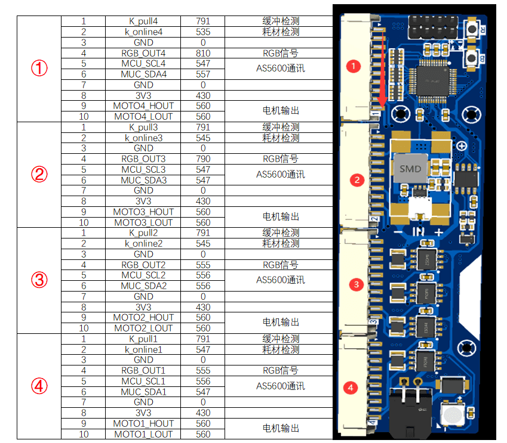

# 对地值参考

::: info 提示
该页面全部内容有群友`@→`提供，`@丸子`进行少许排版改动
:::

## 基础解释

知道的不多，捡我知道的说。

- [什么是对地值](https://baike.baidu.com/item/%E5%AF%B9%E5%9C%B0%E6%89%93%E9%98%BB%E5%80%BC/5430067)
  
- 为什么用对地值，因电路中存在大量二极管。且二极管的特性，其压降常在一个特定范围，数值较为直观。
  
- **对地值**也是常说的对地阻值，但它不是电阻值，而是电路中二极管对地的压降值，单位是V，至于为什么叫对地阻值，那我也不知道，你得问维修界的，通常读取这个数值时是不带单位的，如0.450V称值450。

- 要注意的是芯片工艺，温度，二极管类型，万用表不同表笔输出的电压不同都会对这个值的测量产生浮动范围，因此文中得值均做参考，实际得值要与芯片其他脚位做参考对比，那怎么得到最正确值，你可以焊前测量记录。通常集成度较高的芯片，值更低，如CPU通常0.2V+，硅二极管0.6-0.7V，硅晶体管:0.7-1.2V，肖特基0.2-0.4V。

## 怎么测量对地值

- 测量对地值，需要把万用表打到**二极管档位**，很多表二极管档和蜂鸣档直接融合，数值较低会蜂鸣，较大会显示压降，有些则需要打到蜂鸣档按功能键，使用时注意单位即可。

- 如图在测量时把红表笔接PCB的 GND 端，黑笔去触碰被测点（**测负电压时需要反过来，如电脑电源的-5V -12V**）
  
- 被测点中如果串联电容，值应无穷大，如该点同时联通多个芯片，则该线路上任意一点的值相同且代表最小值的芯片。

## 测量

### 示例

如图的排针座，我们把红笔接触到PCB中任意GND，如24V输入MX3.0端子的负极，黑笔测量RX，可能会得到的值 **730 790 430 0.000 OL** 。前文说过，该值体现的是被测点经过芯片到达GND的压降，会显示最小芯片的值，而RX点通过电路图我们可得知它同时连接CH32的31脚、75176的1脚、排阻RN3的3脚上拉。下面来分析一下各值。

- **730**  
该值为75176芯片的值，表示该点与芯片未断路、且75176与GND连接正常，75176芯片无异样，但并不能表明该点与芯片CH32 31脚、RN3 3脚是否虚焊开路，芯片引脚是否连锡，可测试这些点是否值相同且。

- **790**
该值为CH32的值，未显示最小值730，表明可能存在开路。同上RN3值应相同或为730.

- **430**
该值为3V3对地值，该点与3V3短路，可能原因RN3 3脚与3V3连锡。

- **0.000**
对地导通。

- **OL**
该点与芯片开路。  

### 排座对地值参考

- 我的数值参考

### 2.0接口对地值参考

- 我的数值参考

- 群友的数值参考

### 小板对地值参考

- 我的数值参考

- 群友的数值参考

- 那我的值跟上面都不一样，无法对比怎么办？正如人与人的体质不一样，芯片也不一样，上下浮动正常，就算数值超出1.0V，击穿部分但如果它没全坏，有些部分还是能工作的，只要不是对地短路，都可以放心上电试试。
- 我的数值跟上面都一样，确认连线正确，TTL设备完好，还是无法烧录，无法解锁识别怎么办？搬板大法，建议只焊接芯片CH32、排阻RN3，短接B按钮的焊点，只满足TTL工作条件进行烧录测试。
