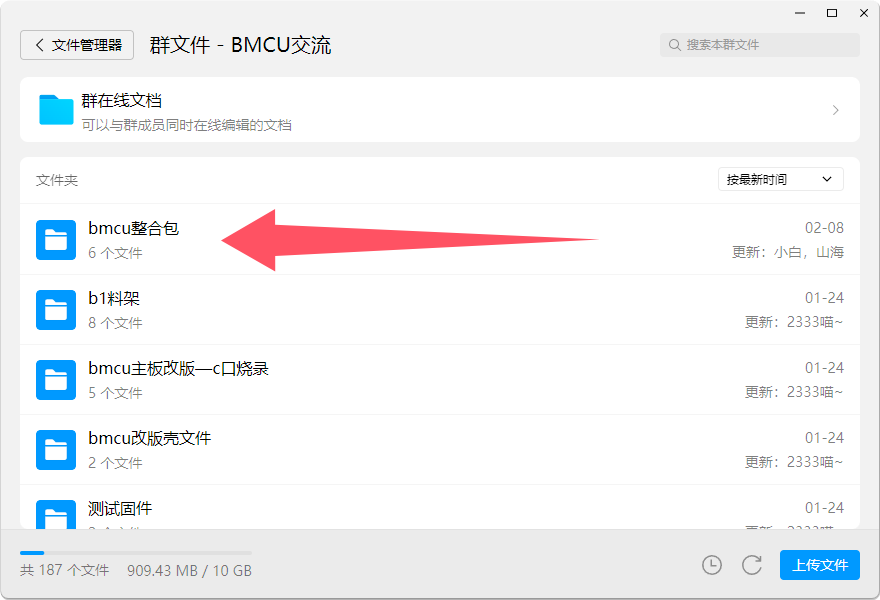
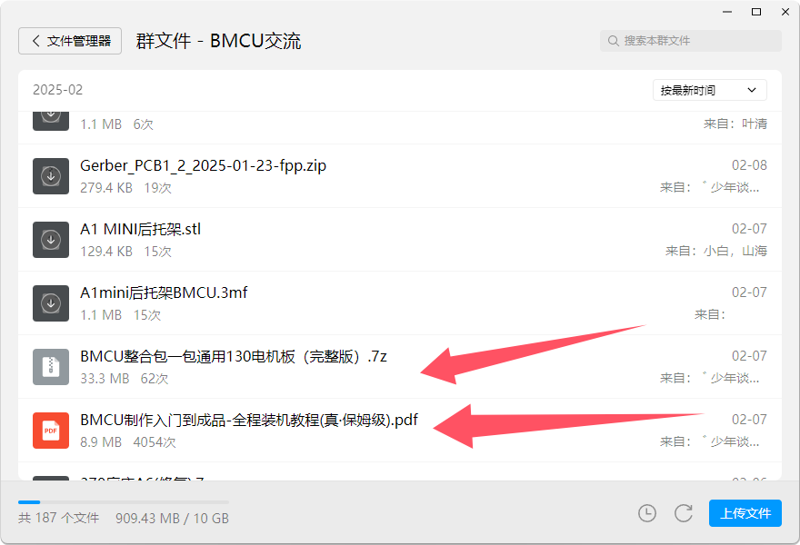

# 版本分支

## 整体版本

大致分为`130电机版`和`370电机版`

两者的主板通用，但固件、外壳、部分机械零件有所区分

### 130电机版

该版本是早期版本，其维护点主要在于`三角板离合`结构

>该版本设计时采用的`万宝至FF130-SH`电机目前貌似仅能通过闲鱼购买，详细信息查看下一页

该版本资料位于群文件 `/bmcu整合包` 中，装机教程可以在群文件根目录找到（也可以找群友要），视频教程可以[前往哔哩哔哩](https://www.bilibili.com/video/BV1PuPCehEP3)观看
 

### 370电机版

该版本目前正在开发和改进，后续可能进行设计修改

该版本结构简单，电机易于购买，但由于尚未结束设计，资料较少。

## 外壳版本

:::warning 注意
外壳版本鱼龙混杂，版本繁多，可以跟着教程做，使用教程中使用的版本
:::
